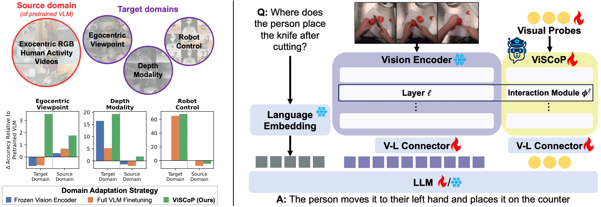

<div align="center">
<h5>

<h2><a href="https://arxiv.org/" style="color:#9C276A">
ViSCoP: Visual Probing for Domain Adapatation of Vision Language Models</a></h2>

[](https://arxiv.org)
[](https://huggingface.co/datasets/dreilly/ViSCoP_data)

</h5>

<p align="center">

</p>

</div>

## ⚙️ Installation
1. Create a conda environment
```shell
conda create --name=viscop python=3.10
conda activate viscop
```

2. Clone ViSCoP and install the required Python packages (we use `torch 2.4.0 + cuda 12.4` in our experiments)
```
git clone https://github.com/dominickrei/ViSCoP.git
cd ViSCoP
pip install -r requirements.txt

pip install flash-attn --no-build-isolation
```

## 🏋️ Training ViSCoP
### 🎥 Preparing Training Data for Egocentric Viewpoint and Depth Modality
We provide the instruction pairs as well as videos for training through [HuggingFace](https://huggingface.co/datasets/dreilly/ViSCoP_data). After downloading the data, update the following varaibles in `scripts/train/ego_depth_video/train_viscop.sh`:
* `DATA_DIR`: Update with the path to either egocentric or depth videos
* `TRAINING_JSON`: Update with the path to either egocentric or depth instructions

### 🤖 Preparing Training Data for Simulated Robot Control
Firstly, download and extract the VIMA data through [HuggingFace](https://huggingface.co/datasets/VIMA/VIMA-Data). Next, generate the training instruction pairs using the [conversion script provided by LLaRA](https://github.com/LostXine/LLaRA/blob/main/datasets/convert_vima.ipynb). We use the `D-inBC-text-multi-train-8k-front` instructions for all of our simulated robot control experiments.
* After extracting the VIMA data and generating the instructions, update `DATA_DIR` and `TRAINING_JSON` in `scripts/train/robotic_control/train_viscop.sh`

### 🤖 Preparing Training Data for Real-world Robot Control

**Coming soon!**

### 🔥 Update Training Script and Launch Training
In `scripts/train/ego_depth_video/train_viscop.sh` and `scripts/train/robotic_control/train_viscop.sh`, update the following arguments to match your system settings and paths:
* `INIT_MODEL`: This is the path to weights of the base VLM (VideoLLaMA3). Please use the following command to download and save the weights `python scripts/save_basevlm_for_finetuning.py --save-path-for-local-basevlm /path/to/save/base_vlm`
* `DATA_DIR`: The path to your data directory containing the egocentric, depth, or robot control data
* `TRAINING_JSON`: The path to a json file containing the egocentric, depth, or robot control instructions
* (Optional) `NUM_VISUAL_PROBES`: The number of Visual Probes to use in ViSCoP
* (Optional) `INTERACTION_MODULE_POS`: The positions of the interaction modules. Acceptable values are `all` or a comma-separated list of integers (denoting zero-indexed layer indices of the vision encoder)

(**Single node training**) After updating the training scripts, initiate the training with the following command:
```shell
bash scripts/train/ego_depth_video/train_viscop.sh 1 <NUM_GPUS>
```

(**Multi-node training with SLURM**) After updating the training scripts, update the arguments in `ex_multi_node_slurm_job.sh` and submit the job:
```shell
sbatch ex_multi_node_slurm_job.sh
```

## ❄️ Evaluating ViSCoP
### Preparing Target Domain Data


### Preparing Source Domain Data


## 🛠️ Building on ViSCoP


## 🙏 Acknowledgements
We thank the researchers behind the following codebases and model releases for their great open source work which ViSCoP builds upon! [VideoLLaMA3](https://github.com/DAMO-NLP-SG/VideoLLaMA3), [LLaVA-OneVision](https://github.com/LLaVA-VL/LLaVA-NeXT), [Qwen2.5-VL](https://github.com/QwenLM/Qwen2.5-VL), [SigLIP](https://arxiv.org/abs/2303.15343), and [Qwen2.5](https://arxiv.org/abs/2412.15115).
